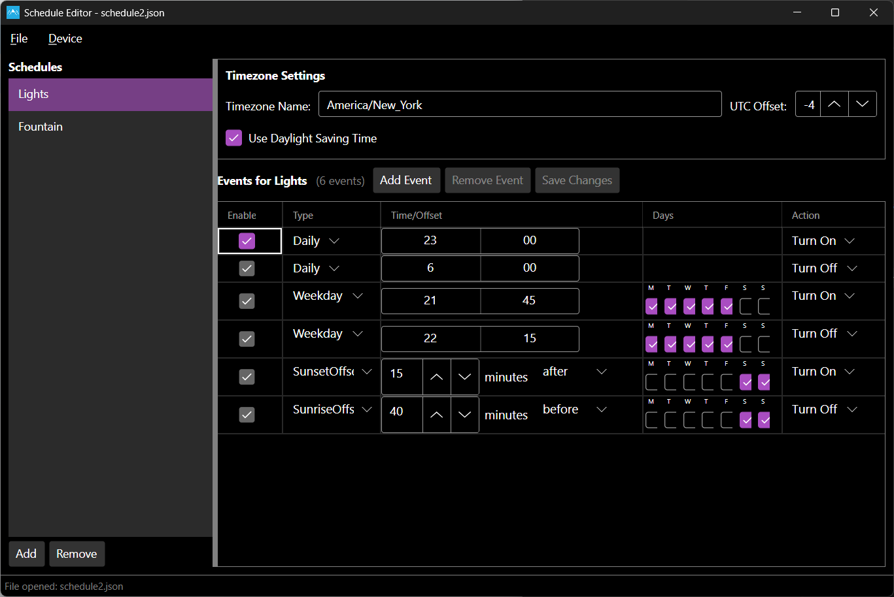

# Meadow Schedule Editor

A cross-platform desktop application for creating, editing, and managing MicroScheduler schedule files for Meadow IoT devices. This tool provides a graphical interface to design complex time-based automation schedules that can be deployed to Meadow devices.



## Purpose

The Schedule Editor is designed to simplify the creation and management of time-based automation schedules for Meadow IoT devices. It eliminates the need to manually write JSON schedule files by providing an intuitive graphical interface for defining when and how your IoT devices should respond to time-based events.

## Key Features

### Schedule Management
- **Create and Edit Schedules**: Design multiple named schedules (e.g., "Lights", "Fountain", "Irrigation")
- **File Operations**: New, Open, Save, and Save As functionality for schedule files
- **Visual Timeline**: Intuitive interface showing when events occur

### Event Types Supported
- **Daily Events**: Trigger at specific times every day
- **Weekday Events**: Trigger on specific days of the week at designated times
- **Solar Events**: Sunrise/sunset-based triggers with configurable offsets
- **Custom Data Payloads**: Each event can carry custom data (boolean, strings, etc.)

### Device Integration
- **Direct Device Communication**: Connect to Meadow devices via serial port
- **Load from Device**: Pull existing schedules directly from connected Meadow devices
- **Deploy to Device**: Push schedules directly to Meadow devices
- **Runtime Control**: Automatically manage device runtime state during file transfers

### Timezone Support
- **Timezone-Aware Scheduling**: Full support for timezone-specific scheduling
- **Daylight Saving Time**: Automatic handling of DST transitions
- **Local Time Display**: Events displayed in local timezone while stored in UTC

## Usage

### Getting Started
1. **Launch the application** - The Schedule Editor will start with an empty schedule
2. **Create a new schedule** - Use "Add Schedule" to create named schedule groups
3. **Add events** - Define when actions should occur using various event types
4. **Save your work** - Export to JSON files or deploy directly to devices

### Working with Schedules
- **Multiple Schedules**: Organize related events into logical groups (e.g., separate schedules for lighting, irrigation, security)
- **Event Configuration**: Each event can be configured with:
  - Trigger time or solar offset
  - Days of week (for recurring events)
  - Custom data payload
  - Enable/disable state

### Device Deployment
1. **Connect Device**: Select your Meadow device from the detected serial ports
2. **Deploy Schedule**: Use "Save to Device" to transfer your schedule
3. **Verify Deployment**: Load the schedule back from the device to confirm successful transfer

### File Format
Schedules are saved as JSON files compatible with the Meadow.Foundation.MicroScheduler library:
```json
{
  "timezone": {
    "timezoneName": "America/New_York",
    "utcOffsetHours": -5.0,
    "daylightSavingTime": { ... }
  },
  "schedules": [
    {
      "name": "Lights",
      "events": [
        {
          "eventType": "Daily",
          "data": "true",
          "eventTime": "2024-01-01T23:00:00"
        }
      ]
    }
  ]
}
```

## Technical Details

- **Framework**: Built with Avalonia UI for cross-platform compatibility (Windows, macOS, Linux)
- **Language**: C# with .NET 8
- **Architecture**: MVVM pattern with ReactiveUI
- **Meadow Integration**: Direct integration with Meadow CLI tools for device communication
- **File Format**: JSON-based schedule files compatible with MicroScheduler library

## Requirements

- .NET 8 Runtime
- Meadow device (for device deployment features)
- Serial port access (for device communication)

## Use Cases

- **Home Automation**: Schedule lights, fans, and appliances
- **Agricultural IoT**: Automate irrigation, feeding systems, and environmental controls
- **Commercial Applications**: Manage lighting, HVAC, and security systems
- **Research Projects**: Coordinate sensor data collection and device operations
- **Educational Projects**: Teach time-based programming concepts with visual feedback
